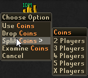
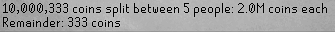
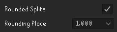
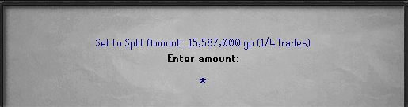

# Quick Split Calc
A simple little plugin that adds a Split Option to your stack of coins and will tell you how much each person gets of a split

# Features
- Split Option in right-click menu of coin;  Quickly Select between 2-5 Players or enter your custom team size  

- Rounding Mode Toggle; Choose to round split amounts to the nearest 100, 10, or 1 thousands  

  
- Split Helper; Shows a small overlay with the split amount in your Offer-X screen  

# Change Log
## V1.0.0 - Initial Release
- Added Split Option to coin stack right-click menu
- Added Team Size input field
- Added Rounding Mode toggle

## v1.1.0 - Update - Stuff that Should have been in 1.0
- Updated Rounding Mode feature to round split amounts to the 100, 10, or 1 thousands place in Config Menu
- Added Split Helper and its Option to disable in the config menu
